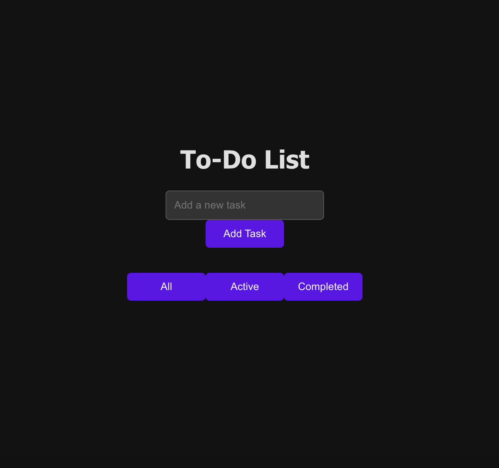
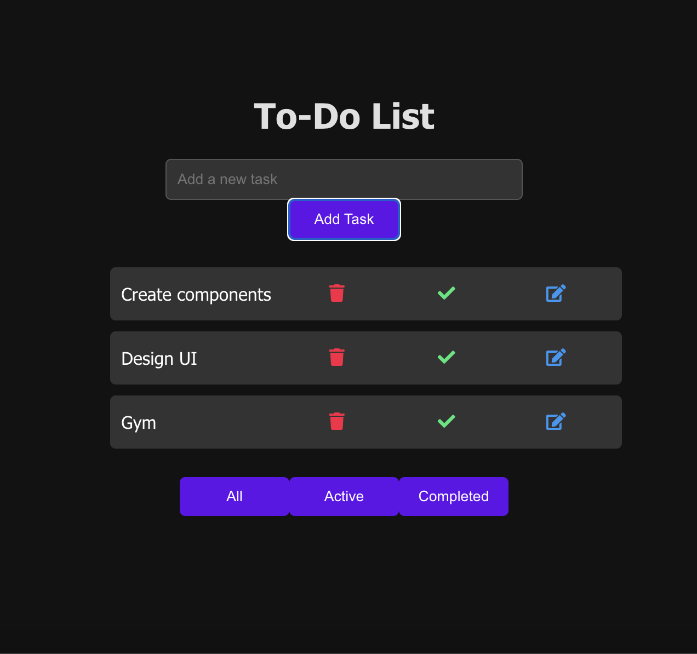
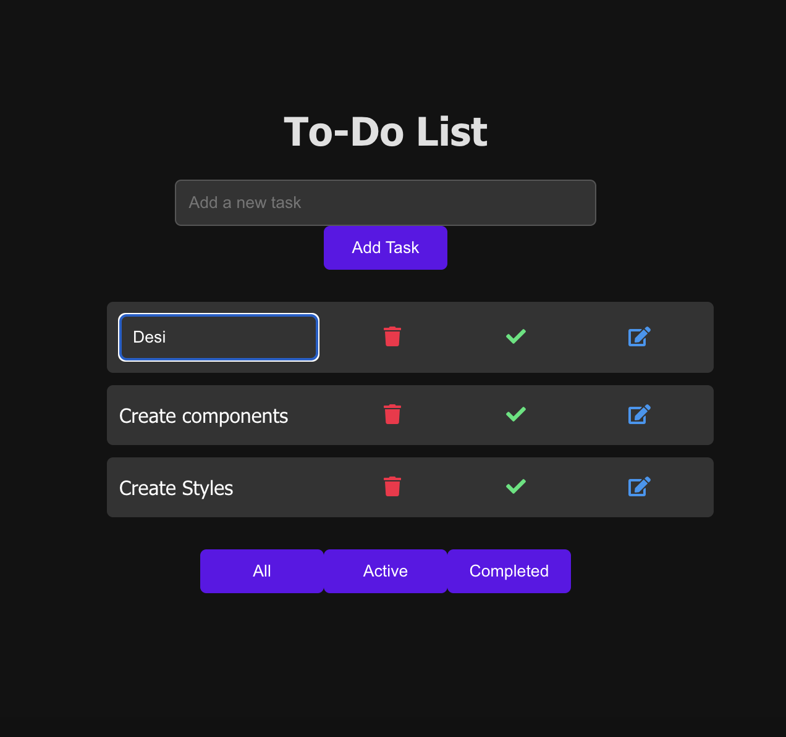
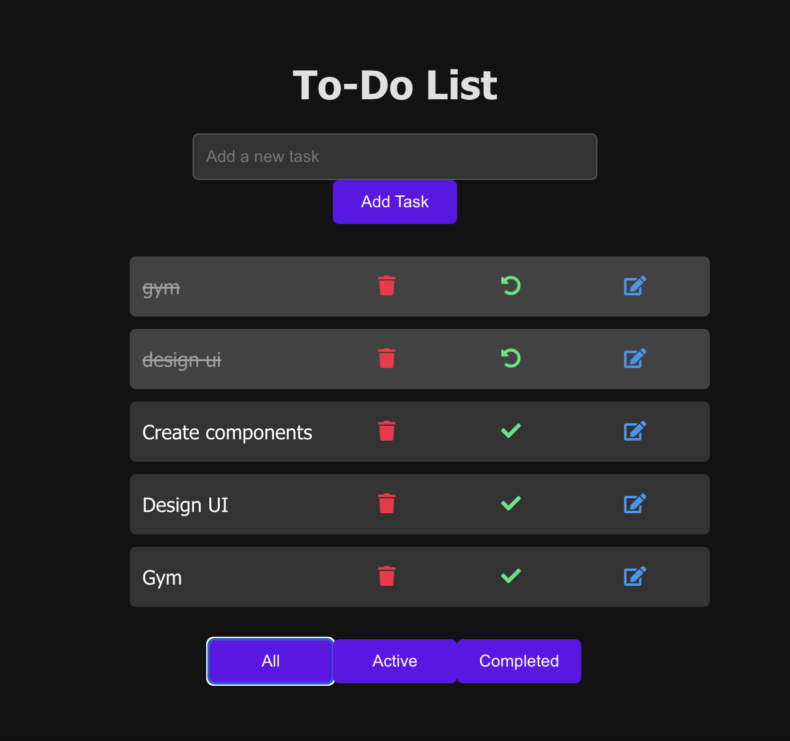
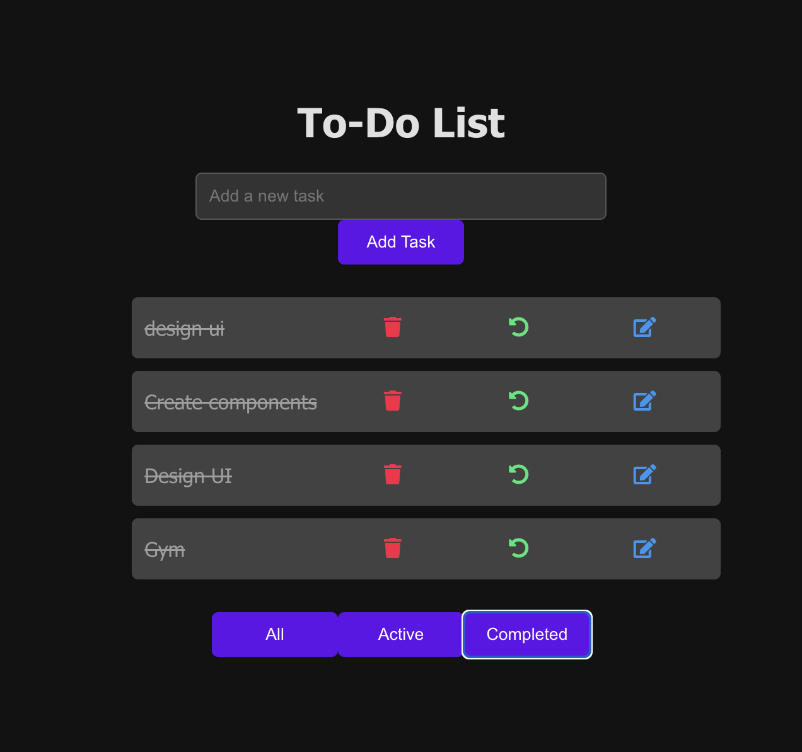

# To-Do List Application

# Overview

- This To-Do List application allows users to effectively manage their daily tasks with an easy-to-use web interface. It supports various functionalities such as adding, deleting, filtering, editing, and marking tasks as complete. This app is built using the MERN stack (MongoDB, Express.js, React.js, Node.js), which offers a full-stack JavaScript solution for a rich and interactive user experience.

# Features

- Task Addition: Users can add new tasks to the list.

- Task Deletion: Users can remove tasks they no longer need.

- Task Editing: Users can edit existing tasks to update their details.

- Task Toggle: Users can mark tasks as complete or revert them to incomplete.

- Task Filtering: Tasks can be filtered to show all, active, or completed tasks.

- Persistence: Tasks are stored in MongoDB, ensuring they persist between sessions.

# Technologies Used

- MongoDB: A NoSQL database used to store task data persistently.

- Express.js: A web application framework for Node.js, used to build the server-side logic.

- React.js: A JavaScript library for building the user interface, bootstrapped with Create React App.

- Node.js: A JavaScript runtime built on Chrome's V8 JavaScript engine, used to run the server.

- CSS3: For styling the application.

# ScreenShots

